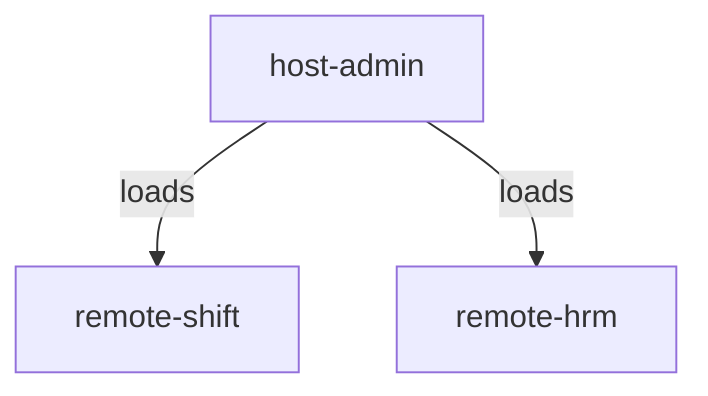

# MF-S3: Module Federation Example

This project demonstrates a micro-frontend architecture using **Module Federation** with React. It consists of a host application and multiple remote applications, all orchestrated for local development and integration.

## Module Federation Overview

- **Host (`host-admin`)**: The main application that loads remote modules at runtime.
- **Remotes (`remote-shift`, `remote-hrm`)**: Independent applications exposing components to the host via module federation.

This setup allows independent deployment and development of each micro-frontend, while enabling seamless integration in the host.

## Docker Compose Services

The included `docker-compose.yml` provides supporting infrastructure:

- **minio**: S3-compatible object storage, useful for local development and testing.
- **nginx**: Reverse proxy for MinIO, exposing it on port 8080.

## Architecture Diagram



## Usage

Start supporting services:  
```sh
docker-compose up
```

Do not forget to create buckets, and to make them public.

```sh
# Set up MinIO client (mc)
mc alias set local http://localhost:9000 minioadmin minioadmin

# Create a bucket (example: host-admin)
mc mb local/host-admin

# Make the bucket public (example: host-admin)
mc anonymous set public local/host-admin
```

The following scripts are available from the root `package.json`:

```sh
pnpm install           # Install all dependencies for all packages
pnpm dev:remote        # Start all remote apps in dev mode
pnpm build             # Build all remotes and host
pnpm build:remote      # Build all remote apps
pnpm build:host        # Build the host-admin app
pnpm preview:host      # Preview the built host-admin app
```

---
# mf-nginx
# mf-nginx
