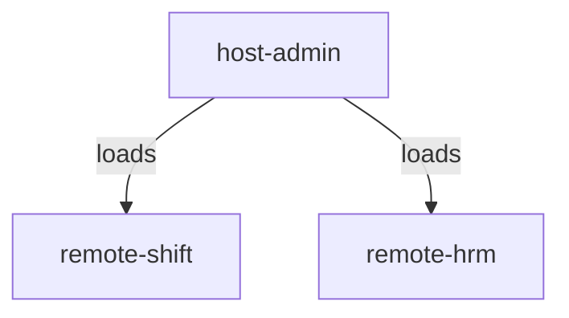

# MF-nginx: Module Federation Example

This project demonstrates a micro-frontend architecture using **Module Federation** with React. It consists of a host application and multiple remote applications, all orchestrated for local development and integration.

## Module Federation Overview

- **Host (`host-admin`)**: The main application that loads remote modules at runtime.
- **Remotes (`remote-shift`, `remote-hrm`)**: Independent applications exposing components to the host via module federation.

This setup allows independent deployment and development of each micro-frontend, while enabling seamless integration in the host.

## Architecture Diagram



## Usage

### Build

```sh
$ docker build . -f Dockerfile --tag mf-nginx_host-admin --build-arg SERVICE_NAME=host-admin
$ docker build . -f Dockerfile --tag mf-nginx_remote-shift --build-arg SERVICE_NAME=remote-shift
$ docker build . -f Dockerfile --tag mf-nginx_remote-hrm --build-arg SERVICE_NAME=remote-hrm
```

### Run

```sh
$ docker run -p 80:80 mf-nginx_host-admin:latest
$ docker run -p 9000:80 mf-nginx_remote-shift:latest
$ docker run -p 9001:80 mf-nginx_remote-hrm:latest
```